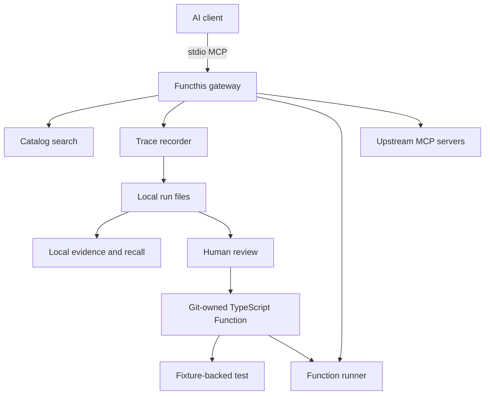

# Functhis Roadmap

An open-source TypeScript runtime that lets agents compose MCP tools into testable, code-owned functions and expose them back as MCP tools.

Status: proposed implementation roadmap — local crystallization direction  
Date: 2026-08-27  
Audience: maintainers and the first solo engineer

## Progress tracker

Use this section as the live checklist. Mark items `[x]` when done; leave `[ ]` for pending work.

### Milestones

- [x] **M0 — Foundation:** roadmap, single package, CLI placeholder, license, tests
- [x] **M0 complete:** remove legacy starter apps, CI, fake MCP servers, tarball CI — partial: legacy apps removed, CI and fake servers done; tarball CI deferred
- [x] **M1 — Skill + discovery spike:** MCP SDK, meta-tools, `skills/functhis/SKILL.md`
- [x] **M2 — Trace capture:** redacted runs, evidence addresses, stats, timeouts
- [x] **M3 — Function compilation:** `fn this`, reviewed TypeScript, tests, replay
- [x] **M4 — Function reuse:** expose compiled Functions as MCP tools
- [x] **M5 — Public MVP:** npm `0.1.0`, setup/import docs, hardening
- [x] **M6 — Multi-tool execution:** selection, DAG, approvals
- [ ] **Cloud validation:** paid design partner, hosted runner prototype
- [ ] **Cloud Code Mode:** isolated `search`/`execute` only after hosted demand

### Product layers

- [x] **Layer 01 — Skill:** installable agent Skill, no account
- [x] **Layer 02 — CLI/MCP:** local gateway works end to end
- [x] **Layer 03 — Evidence:** local traces, references, redaction, recall
- [x] **Layer 04 — Functions:** git-owned TypeScript, tests, replay, MCP expose
- [ ] **Layer 05 — Cloud:** optional hosted run (commercial, later)
- [ ] **Layer 06 — Enterprise:** SSO / on-prem (commercial, later)

## 1. Executive summary

Functhis is an open-source TypeScript runtime that lets agents compose MCP tools into testable, code-owned functions and expose them back as MCP tools.

It is also a local, open-source MCP gateway that discovers tools, records successful agent executions, and compiles repeated tool sequences into reusable TypeScript Functions.

Instead of storing workflows in a proprietary runtime, Functhis generates readable, testable code owned by the developer and exposes it back to agents as a single MCP tool. The initial product is deliberately smaller than a general automation platform: MCP only, local execution, no account, no cloud, no browser, and no arbitrary model-supplied code.

The product is inspired by the local method-layer described by [Rote](https://www.modiqo.ai/blog/what-rote-is), but narrows the scope to a portable MCP execution layer for a local computer. Rote's CALL, SHELL, and DRIVE become MCP CALL first. Context-addressable evidence becomes a simple local trace store. A successful path becomes a developer-owned TypeScript Function rather than a vendor-owned Play runtime.

```text
01 Skill     open source, install in an agent
02 CLI/MCP   local engine, no account
03 Evidence  local traces, references, recall
04 Functions git-owned TypeScript, tests, replay
05 Cloud     optional hosted run, teams, secrets
06 Enterprise later, only after paid demand
```

The initial wedge remains:

```text
discover MCP tools
        -> execute through one local gateway
        -> capture evidence from a successful run
        -> review and compile a TypeScript Function
        -> test and replay without model reasoning
```

Lazy tool discovery and intermediate-result filtering support the core loop; they are not the product claim by themselves. The differentiator is that a successful local MCP path becomes a readable artifact that can be committed, tested, moved, and reused without Functhis Cloud.

The long-term opportunity is a library of portable Functions that can run locally, behind an MCP server, or in Functhis Cloud without forcing a customer to surrender credentials or rewrite the Function. Cloud is a planned possibility, not a day-one product. The largest technical risk is that traces contain hidden model judgment, unstable data dependencies, secrets, or non-idempotent writes and therefore cannot be compiled safely. The largest market risk is that users value gateway convenience more than crystallization.

Recommended public MVP: a single open-source Node.js package containing a stdio MCP server, the `fn` CLI, and an installable Agent Skill. The Skill teaches compatible agents the compact search → describe → call workflow and how to request capture or compilation. The CLI provides setup, import, inspection, testing, and replay. It should support read-only workflows first and make no claim that arbitrary agent traces are safely reusable. Cloud APIs, if added later, must consume the same TypeScript Function contract the local runner already uses.

## 2. Verified repository state

Last updated against the working tree. Checkboxes reflect the repo as of the latest roadmap edit.

### Facts

The repository at `/Users/mackan/dev/startups/openenvx/functhis` implements M1: Skill, CLI, stdio MCP gateway, fake-server harness, and a schema-token benchmark.

**Present**

- [x] [FUNCTHIS_ROADMAP.md](FUNCTHIS_ROADMAP.md) — product and implementation plan
- [x] [package.json](package.json) — single-package `functhis@0.0.1`, `fn` / `functhis` bins, Node `>=22`
- [x] [tsconfig.json](tsconfig.json) — strict ESM TypeScript build to `dist/`
- [x] [src/cli.ts](src/cli.ts) — CLI with `setup`, `doctor`, `serve`, `stats`
- [x] [test/cli.test.ts](test/cli.test.ts) — CLI and doctor integration tests
- [x] [LICENSE](LICENSE) — Apache-2.0
- [x] [README.md](README.md) — five-minute local flow and safety limits
- [x] [eslint.config.js](eslint.config.js) — TypeScript ESLint config
- [x] [bun.lock](bun.lock) — lockfile for dependencies
- [x] Local scripts: `build`, `check-types`, `lint`, `test` pass on a dev machine
- [x] MCP client/server via `@modelcontextprotocol/client` and `@modelcontextprotocol/server` v2
- [x] [skills/functhis/SKILL.md](skills/functhis/SKILL.md) — installable Agent Skill
- [x] Fake stdio MCP servers under `fixtures/servers/` and integration harness
- [x] Upstream config model (`~/.functhis/upstreams.json` or `.functhis/upstreams.json`)
- [x] CI workflow (`.github/workflows/ci.yml`)
- [x] Benchmark report [benchmarks/m1-discovery.md](benchmarks/m1-discovery.md)

**Not present yet**

- [ ] Trace store, Function schema, replay runner
- [ ] npm publish workflow, `SECURITY.md`, `CONTRIBUTING.md`
- [ ] Tarball install smoke test in CI
- [ ] Real upstream benchmark with provider-reported usage

**Legacy starter residue (remove during M0 completion)**

- [x] Delete [apps/web](apps/web) and [apps/docs](apps/docs) Next.js stubs
- [x] Confirm no remaining Turbo monorepo references in docs or config

**Other**

- [ ] The Neroli repository mentioned in the product brief is not present in this checkout
- [x] MCP gateway implementation (`fn serve`, upstream manager, catalog, policy)

### Assumptions

- [x] The Next.js applications are scaffolding and are not a required product surface
- [x] A single package is more appropriate than retaining a web/docs monorepo for the first runtime
- [ ] Users will accept reviewing generated Function inputs before replay
- [ ] Read-only MCP workflows are sufficient to prove initial value

### Unresolved questions

- [ ] Which real Neroli workflow is available for the first external validation?
- [x] License choice for the open core — Apache-2.0 selected for foundation
- [ ] Which two real MCP servers can be used in a reproducible, credential-safe benchmark?
- [x] Functions live in a user-selected project-owned `functions/` directory; Functhis provides the runtime and generator
- [ ] Which MCP SDK release line is stable when implementation starts? Pin and verify during the spike

## 3. Competitive analysis

| Alternative | Actual capabilities | Lazy discovery | Code execution | Reusable routines | Portable artifact | Tests/policies | License and adoption | What Functhis must do differently |
| --- | --- | --: | --: | --: | --: | --: | --- | --- |
| [Toolport](https://github.com/tsouth89/toolport) | Local Tauri app and gateway, multi-client setup, namespaced routing, OS keychain, approvals, integrity/content checks, resources/prompts proxy, HTTP mode, Code Mode, saved routines | Yes | Yes, gateway-hosted JS | Yes, approval-gated routines | No: routines depend on Toolport | Partial: approvals, risk, fingerprints, audit; not a user-owned fixture/test package | MIT; about 187 stars, 49 forks, 1,255 commits at research time | Make the Function a small, git-owned artifact with explicit inputs, fixture, provenance, and replay test; do not compete on desktop management |
| [Cloudflare Code Mode](https://developers.cloudflare.com/agents/model-context-protocol/codemode/) | One `code` tool or `search`/`execute` for OpenAPI; sandboxed Worker execution; intermediate-result processing | Yes, in connector/OpenAPI patterns | Yes, isolated Worker JS | No user-owned Function package | No, runtime-dependent | Sandbox and host callbacks; deployment is Cloudflare-specific | Cloudflare platform; adoption not comparable to OSS stars | Be local, MCP-agnostic, and exportable; never assume a Worker account |
| [Anthropic Code Execution with MCP](https://www.anthropic.com/engineering/code-execution-with-mcp) | Tool files/search, programmatic tool calls, sandbox processing | Yes | Yes, platform sandbox | No portable routine format | No | Platform sandbox; provider-specific | Anthropic platform feature | Work across MCP clients and preserve artifacts outside a model provider |
| [rote](https://www.modiqo.ai/) | Local adapters for OpenAPI, GraphQL, MCP, Discovery and local data; traces; versioned Plays; recall; guards; CLI and VS Code; registry direction | Yes | Runtime-specific TypeScript/CLI execution | Yes, core value | Plays require rote runtime | Strong inspectability, access/effect declarations, provenance, approvals, versioning | BSL 1.1 core, Apache-2.0 community content; release repo about 5 stars | Avoid a registry-first or proprietary runtime dependency; make the canonical artifact simple and open |
| [etchplan](https://github.com/Egoist-Machines/etchplan) | Python trace capture, recurring-workflow mining, guarded ExecutionPlans, shadow/approval/canary, fallback, audit | Yes, indirectly | Runtime execution, optional integrations | Yes, automatically mined | YAML is inspectable but execution depends on etchplan | Strong validation, mutation gates, drift kill switch | Apache-2.0; about 27 stars and PyPI package | Start with explicit human review instead of automatic mining; make generated tests and repository ownership central |
| [mcp-gateway](https://github.com/MikkoParkkola/mcp-gateway) | Rust single binary, meta-tools, MCP/REST aggregation, transforms, profiles, webhooks, HTTP/SSE/WebSocket | Yes | Not the primary product | No | No | Profiles and annotations | MIT; about 38–52 stars | Do not rebuild its broad gateway feature set |
| [lazy-tool](https://github.com/mcp-shark/lazy-tool) | Local Go binary, SQLite catalog, direct/search/hybrid modes, explicit stdio/HTTP sources | Yes | No | No | No | Basic routing and catalog controls | MIT; about 26–34 stars | Use the smallest gateway substrate only to enable capture and replay |
| [mcpmux](https://github.com/omer-ayhan/mcpmux) | Five meta-tools, heuristic ranking, profiles, concurrency, stdio proxy | Yes | No | No | No | Risk scoring and allow/deny options | MIT; approximately 0 stars at research time | Search is a commodity, not differentiation |
| [Caveman](https://caveman.so/) | Open-source Skill that shortens agent output; local proxy/CLI for context compression; Agent SDK; Cloud and Enterprise in development | No, not an MCP catalog gateway | No MCP crystallization | No Function artifact | No | Spend visibility, eval gates, signed savings claims | MIT Skill plus closed-source proxy; large GitHub attention | Copy the Skill → local CLI → optional Cloud distribution, not the compression product |

### Positioning conclusion

“MCP gateway with fewer tokens” is copied and increasingly built into model platforms. “Agent work becomes a user-owned Function with a contract, fixture, test, provenance, and safe replay” is a meaningful product distinction, but it is not yet defensible: Toolport has saved routines, rote has Plays, and etchplan has validated plans. Functhis earns differentiation only if its artifact is substantially easier to inspect, review, commit, test, move, and run without the vendor.

Research signals are directional, not demand proof. Stars, forks, PyPI availability, and marketing claims do not establish retention, task success, or willingness to pay. Caveman’s 74k GitHub stars prove that a Skill can spread quickly; they do not prove that Functhis would get the same demand, because the jobs are different.

## 4. Product scope

Functhis should ship as a stacked product, similar to Caveman’s layers, with a different job at each layer:

| Layer | Form | Status | License intent | Account required | Job |
| --- | --- | --- | --- | --- | --- |
| 01 Skill | `skills/functhis/SKILL.md` plus agent-plugin packaging | [x] M1 | Open source | No | Teach agents how to discover, call, capture, and reuse MCP work |
| 02 CLI/MCP | `fn` binary and stdio MCP server | [x] M1 | Open source | No | One local execution surface: discovery, calls, traces, and Functions |
| 03 Evidence | Local trace files and addressable results | [ ] M2 | Open source | No | Preserve what happened so the successful causal path can be reviewed |
| 04 Functions | `functions/*.ts`, fixtures, tests | [x] M3 (compile/replay); [x] M4 (MCP expose) | Open source | No | Compile, test, replay, and expose a successful method as one MCP tool |
| 05 Cloud | Hosted run, team library, secrets | [ ] planned | Commercial, after validation | Yes, for hosted features only | Optional hosted execution without replacing local files |
| 06 Enterprise | SSO, on-prem/BYOC, audit export | [ ] planned | Commercial | Yes | Same contracts, customer-controlled deployment |

The Skill is the distribution wedge. The CLI is the local execution and evidence engine. The TypeScript Function is the durable artifact. Cloud is optional and must never become the only way to run a Function.

### Phase 0: technical spike and benchmark

Prove, with two real upstream MCP servers and fake servers:

- [ ] connect and enumerate tools
- [ ] expose only a compact meta-tool surface
- [ ] search and describe selected tools
- [ ] invoke selected tools correctly
- [ ] capture a complete read-only multi-tool trace
- [ ] remove or filter intermediate data before returning a final result
- [ ] compare direct exposure with Functhis
- [ ] measure schema tokens, full-task provider usage, latency, and correctness

The proposed targets—70% fewer schema tokens, 30% fewer full-task input tokens, no material success reduction, and at most 20% gateway latency overhead—are go/no-go hypotheses, not promises.

The spike should also compare two composition strategies on the same task:

- [ ] local declarative plan (`fn_execute`) with bounded output shaping
- [ ] hosted Code Mode prototype, only if a Cloud design partner supplies a large OpenAPI catalog

Do not treat a Cloud sandbox prototype as evidence that local arbitrary code execution is safe or necessary.

### Phase 1: open-source local Skill + CLI/MCP MVP

This is the first public product and the primary implementation target.

- [x] Node.js CLI with `fn setup`, `fn serve`, `fn doctor`, and `fn stats`
- [x] A stdio MCP server exposing `fn_search`, `fn_describe`, and `fn_call`
- [x] An open-source Agent Skill at `skills/functhis/SKILL.md`, teaching an agent when to search, when to load a schema, how to call a tool, and how to inspect a run. Prefer a one-command install path similar to Caveman (`npx skills add ...` or a Claude Code / Cursor plugin) once the Skill is stable. The Skill must be useful without a Functhis account and must not claim hidden authorization — in-repo Skill done; marketplace install deferred
- [x] Manual upstream configuration with explicit command, args, cwd, and environment-variable references
- [x] Stdio upstream transport first
- [x] Catalog indexing and deterministic MiniSearch/BM25 search
- [x] Namespaced tool IDs and collision handling
- [x] Run capture with redaction, output limits, timeouts, and local statistics
- [x] Manual Cursor and Claude Code setup snippets with backup-before-write — snippets in Skill/README; backup-before-write deferred to M5
- [x] macOS and Linux support; Windows compatibility investigation begins in CI — CI on macOS + Linux

Phase 1 deliberately does **not** include Function generation, arbitrary code execution, automatic client rewriting, OAuth, HTTP transport, embeddings, or a desktop application. Its success criterion is that an open-source user can install one package, connect multiple local MCP servers, and use the Skill to find and call tools safely.

### Phase 2: trace capture and local evidence

- [x] Every gateway call receives a run id and is written to a local trace
- [x] Trace records inputs, outputs, failures, timing, tool fingerprints, and references between calls
- [x] Recursive redaction, output budgets, cancellation, and timeouts
- [x] Evidence can be recalled by address without repeating an upstream call
- [x] `fn inspect <run-id>` and `fn stats` expose human-readable summaries

The trace is evidence, not a workflow. Failed exploration remains available for diagnosis, while compilation later selects only the successful causal path.

### Phase 3: Function compilation and replay

- [x] `fn this <run-id>` creates a reviewed TypeScript Function draft
- [x] Human edits input bindings and confirms required tools and read-only policy
- [x] Generated `functions/<name>.ts`, sanitized fixture, assertions, and provenance
- [x] Generated code is readable, typed, repository-owned, and limited to declared MCP calls; no arbitrary model-supplied code is executed
- [x] `fn inspect`, `fn test`, and `fn run`
- [x] Replay against fresh inputs without model planning
- [x] Drift detection and fail-closed behavior for changed or missing tools

This is the core product boundary: exploration is flexible, but the compiled Function is constrained and reviewable. The artifact must be repository-owned, diffable, testable, and runnable locally without a hosted Functhis dependency.

### Phase 4: Function reuse

- [x] Load reviewed Functions from a project-owned `functions/` directory
- [x] Expose each Function as one MCP tool with a compact input schema
- [x] Search and invoke Functions before exposing raw upstream tools
- [x] Preserve the same runner for CLI, stdio MCP, and future Cloud execution

### Phase 5: public MVP hardening

- [x] npm `0.1.0`, clean-machine install, and tarball smoke test
- [x] Cursor and Claude Code setup/import documentation
- [x] Security policy, diagnostics, and macOS/Linux CI

### Phase 6: reliable multi-tool execution

- [x] JMESPath result selection
- [x] Explicit dependency graph and bounded parallel read steps
- [x] Cancellation propagation, retries only for declared idempotent reads, and whole-run budgets
- [x] Read/write classification, approval boundaries, and mutation gates
- [x] Stronger tool fingerprints and replay regression reports

### Code Mode mapping: local first, cloud later

Cloudflare's [Code Mode MCP pattern](https://blog.cloudflare.com/code-mode-mcp/) combines progressive discovery with an execution boundary. The model receives `search` and `execute` instead of thousands of endpoint tools; intermediate results remain inside the execution environment and only the shaped result is returned. Functhis should adopt this outcome while using different runtimes at different stages:

| Capability | Local open-source implementation | Future Cloud implementation |
| --- | --- | --- |
| Discovery | `fn_search` over a local MCP catalog; `fn_describe` loads selected schemas | Same contract, optionally searches OpenAPI specs without returning the full spec |
| Execution | `fn_call` for one tool; later `fn_execute` accepts a validated declarative plan | Optional `fn_execute_code` runs model-written code in an isolated Worker or equivalent sandbox |
| Composition | Sequential steps first; later bounded DAG, JMESPath selection, and output budgets | Sandboxed loops, branches, pagination, and result shaping |
| Credentials | Local upstream processes keep credentials; Functhis never exposes them to the model | Host callback or connector injects auth; code cannot read environment variables or raw secrets |
| Durable artifact | Reviewed `functions/<name>.ts` plus fixture and test; no arbitrary source execution | Cloud runs the same constrained Function contract; exploratory code is not automatically promoted |
| Safety | No `eval`, no model-supplied JavaScript, default-deny unknown/write tools | Isolate code, restrict network, enforce tenant policy and approval callbacks |

Local `fn_execute` is deliberately a **declarative Code Mode equivalent**, not a JavaScript interpreter. It should be added only after capture and reviewed Function compilation work against real traces. Generated Functions are the portable local artifact; they do not turn the CLI into an arbitrary-code sandbox.

Future Cloud Code Mode is optional. It is justified only for very large OpenAPI/MCP catalogs, hosted schedules, or workflows where loops and branches cannot be expressed safely as a declarative plan. It must not become a requirement for local use or replace the local TypeScript Function.

### Future portability and ecosystem

- [x] Import adapters for existing client MCP configs where setup friction is demonstrated (`fn import cursor` is the first adapter)
- [x] Expose a saved TypeScript Function as an MCP tool
- [ ] Local HTTP/streamable-HTTP execution for headless environments
- [ ] GitHub-friendly install/export and versioning
- [ ] Skills for additional agent harnesses

### Phase 5: commercial validation and optional Cloud

Keep Cloud as a planned possibility from day one, but do not implement it in the MVP. Architecture must leave the door open:

- [x] Document that the constrained TypeScript Function contract is the Cloud API input — do not invent a second hosted format
- [x] Document that local credentials never upload; Cloud uses customer-managed secrets or OAuth connectors
- [x] Document that a Function generated locally must run in Cloud later without rewriting
- [x] Document that a Function generated or stored in Cloud must export back to git and run with the open-source CLI
- [x] Document that telemetry stays off by default in the local product
- [ ] Implement any Cloud service

Only begin Cloud implementation after the local product meets the validation gates in section 14. Test demand with a paid design partner and a single-tenant or BYOC deployment before building multi-tenant infrastructure. Candidate paid capabilities are hosted execution, team Function libraries, managed secrets, schedules/webhooks, shared policies, approvals, audit logs, alerts, and deployment history.

Cloud Code Mode is a later capability within this phase, not a Phase 1 dependency:

- [ ] Validate a real customer need for OpenAPI catalogs too large for normal schema discovery
- [ ] Build a single-tenant sandbox proof using `search` and `execute`
- [ ] Enforce host-side authorization, network allowlists, resource limits, and approval callbacks
- [ ] Prove that local TypeScript Function artifacts execute unchanged in Cloud
- [ ] Keep model-written exploratory code ephemeral unless a human reviews and promotes its resulting plan

Do not copy Caveman’s closed-source local proxy as Functhis’s core. The Skill, CLI, MCP server, and Function format should remain open source so users can leave Cloud without losing their work.

The MVP does not include a general DAG DSL. It records a sequential successful trace, preserves evidence references, and lets the user review input bindings before generating a constrained TypeScript Function. This is safer and smaller than pretending that every model decision can be inferred.

### Post-MVP

- Restricted result selection using JMESPath.
- Explicit dependency graph and bounded parallel read steps.
- Cancellation, retries, idempotency declarations, and mutation approvals.
- HTTP/streamable-HTTP serving.
- More client setup adapters.
- Optional standalone TypeScript export after the constrained Function format stabilizes.
- Tool-definition fingerprints and result prompt-injection warnings.
- Automatic recurrence suggestions only after human-reviewed replay works.

### Cloud validation phase

Only investigate hosted Functions after local validation demonstrates repeated use, safe artifacts, and willingness to pay. Start with a design interview and single-tenant/BYOC experiment, not a distributed architecture. Potential features are managed secrets, scheduled/webhook runs, team policy, approvals, audit export, deployment history, and hosted execution.

### Explicit non-goals

No visual workflow editor, general automation platform, agent framework, integration marketplace, embeddings, arbitrary model-supplied code execution in local mode, desktop app, 35-client auto-rewriter, OAuth broker, scheduled execution, browser automation, automatic mining, cloud deployment, hosted registry, or SaaS multi-tenancy in the MVP. Generated TypeScript is allowed only as a constrained, human-reviewed artifact that calls declared MCP tools. A future Cloud sandbox may support constrained model-written code, but that is a separate product boundary.

## 5. Recommended architecture

### Data flow



### Runtime boundaries

- The model sees compact meta-tools and untrusted upstream content.
- Functhis validates every requested tool, arguments, policy, output budget, and process boundary. Tool hiding is never an authorization boundary.
- Upstream servers retain their own credentials. Functhis passes environment configuration to child processes but never serializes credential values.
- Functions are generated TypeScript plus a constrained runner. Generated code is an inspectable artifact, not arbitrary model-supplied source: it may invoke only declared MCP tools through the Functhis runtime.
- The local filesystem is the trust boundary for configuration, traces, and project-owned Functions.
- Future Cloud is a second runner of the same Function contract. It is not a second source of truth. Local files remain exportable and sufficient.

### Proposed package layout

Start as one package rather than retaining the unused Turbo apps:

```text
src/
  cli.ts
  mcp/
  upstream/
  catalog/
  trace/
  functions/
  policy/
  storage/
  redaction/
  stats/
  testkit/
skills/
  functhis/
    SKILL.md
fixtures/
test/
functions/
```

Useful internal interfaces:

```ts
interface UpstreamConnection {
  listTools(): Promise<DiscoveredTool[]>;
  callTool(name: string, args: unknown): Promise<McpResult>;
  close(): Promise<void>;
}

interface FunctionRunner {
  test(definition: FunctionDefinition, fixture: Fixture): Promise<TestReport>;
  run(definition: FunctionDefinition, input: unknown): Promise<FunctionResult>;
}
```

The current `apps/web`, `apps/docs`, UI package, and generic workspace configuration should be removed or archived only when implementation begins and the maintainer confirms there is no unrelated product depending on them.

The Skill is an instruction layer, not a security layer. It explains the protocol and preferred workflow; Functhis must enforce authorization, validation, and output limits independently of what the model reads.

## 6. Core data models

These are proposals, not implementation requirements.

### Upstream MCP server

```ts
type UpstreamServer = {
  id: string;
  label: string;
  transport: 'stdio';
  command: string;
  args: string[];
  cwd?: string;
  env?: Record<string, string>; // references only; never persisted secret values
  enabled: boolean;
  allowedTools?: string[];
  deniedTools?: string[];
};
```

### Discovered tool

```ts
type DiscoveredTool = {
  id: string; // serverId + "." + toolName
  serverId: string;
  name: string;
  description: string;
  inputSchema: JsonSchema;
  risk: 'read' | 'write' | 'unknown';
  fingerprint: string;
  discoveredAt: string;
};
```

### Execution plan and step

```ts
type ExecutionPlan = {
  version: 1;
  inputs: Record<string, InputDeclaration>;
  steps: ExecutionStep[];
  output: unknown;
  policyId: string;
};

type ExecutionStep = {
  id: string;
  tool: string;
  args: JsonTemplate;
  select?: string; // JMESPath after the post-MVP selection feature
  timeoutMs?: number;
  retry?: { maxAttempts: number; mode: 'none' | 'safe-idempotent' };
};
```

### Trace

```ts
type ExecutionTrace = {
  id: string;
  startedAt: string;
  endedAt?: string;
  status: 'running' | 'succeeded' | 'failed' | 'cancelled';
  inputShape?: unknown;
  calls: TraceCall[];
  finalOutput?: unknown;
  redactionVersion: string;
  toolFingerprints: Record<string, string>;
};
```

The trace should preserve failures for diagnosis while a Function contains only reviewed successful steps.

### Evidence address

```ts
type EvidenceAddress = {
  address: string; // local address such as "@1"
  runId: string;
  callId: string;
  mediaType: 'application/json' | 'text/plain' | 'binary-metadata';
};
```

Every captured call and result gets an address within its run. Later calls may refer to an address instead of copying an unbounded intermediate payload into the model context.

### Function definition

```ts
type FunctionDefinition = {
  apiVersion: 'functhis.dev/v2';
  name: string;
  description: string;
  inputs: Record<string, InputDeclaration>;
  plan: ExecutionPlan;
  outputSchema?: JsonSchema;
  requiredTools: string[];
  policy: AccessPolicy;
  provenance: { sourceRunId: string; createdAt: string };
  runtime: { maxDurationMs: number; maxOutputBytes: number };
  sourcePath: string; // repository-owned functions/<name>.ts
};
```

### Fixture

```ts
type Fixture = {
  version: 1;
  input: Record<string, unknown>;
  expected?: { output?: unknown; assertions?: Assertion[] };
  recordedCalls: SanitizedCall[];
  containsSecrets: false;
};
```

Fixtures are sanitized evidence and regression data, not a response cache or credential store.

### Access policy

```ts
type AccessPolicy = {
  allowedTools: string[];
  writes: 'deny' | 'review-required';
  maxCalls: number;
  maxBytesPerResult: number;
  allowNetwork: 'upstream-only';
};
```

### Token/cost statistic

```ts
type UsageStatistic = {
  source: 'provider-reported' | 'estimated';
  inputTokens?: number;
  outputTokens?: number;
  cachedInputTokens?: number;
  latencyMs: number;
  model?: string;
  taskId?: string;
};
```

## 7. Technical decision record

| Decision | Recommendation | Trade-off and what waits | Spike or proof |
| --- | --- | --- | --- |
| Monorepo | Convert to one package | Less ceremony; split packages only when stable reuse appears | No |
| Node.js | Runtime Node 22 LTS; CI on 22 and 24 | Drops Node 20; avoids tying runtime to current starter declaration | Verify MCP SDK support |
| TypeScript/build | ESM TypeScript, `tsc` or `tsdown`, npm-built JS | Simple source maps and declarations; no custom runtime transpiler | Build/package smoke test |
| CLI | Commander or a similarly small parser | Less magical than a full framework | No |
| Validation | Zod 4 or SDK-compatible Standard Schema | Runtime dependency and schema conversion work | Validate MCP schemas |
| MCP SDK | Official TypeScript client/server packages, pinned after verification | v2 package split may be in flux; isolate adapter layer | Two real servers and Inspector |
| Transport | Upstream stdio; gateway stdio first | Covers local clients; no remote complexity | Must prove lifecycle |
| Process lifecycle | One managed child per configured upstream, lazy start where safe, graceful close, kill timeout | Cold-start latency and stateful-server quirks | Crash, hang, restart tests |
| Schema normalization | Preserve original JSON Schema, add normalized search fields, namespace IDs | Schema dialect edge cases remain | Real catalog fixtures |
| Naming | `serverId.toolName`, escape separators and retain original display name | Longer IDs and migration concerns | Collision fixture |
| Search | MiniSearch/BM25 lexical index with field boosts | Misses paraphrases; embeddings wait | Precision/recall benchmark |
| Plan representation | Generated TypeScript Function backed by a validated plan | Readable and repository-owned; requires strict generation and review | Compile one successful read-only trace |
| Interpolation | Restricted property templates only; no `eval` | Users edit bindings manually | Malformed/path traversal tests |
| Selection | JMESPath after MVP | Adds dependency and query semantics | Compare against simple projections |
| DAG | Sequential trace first; explicit DAG later | Leaves parallelism on table initially | Need independent-step evidence |
| Concurrency | Default 1; bounded parallel reads later | Safer and predictable | Load test before enabling |
| Cancellation | AbortController propagated to MCP calls and children | SDK support varies | Kill/hang integration test |
| Timeouts | Per-call and whole-run deadlines | Some long tools need configuration | Timeout fixture |
| Retries | None by default; only declared idempotent reads | Avoid duplicate writes | Retry policy tests |
| Output limits | Byte and item budgets with explicit truncation metadata | May lose useful data | Oversized/binary tests |
| Binary/resources | Reject or store metadata in MVP; no silent base64 expansion | Limits coverage | Real resource fixture |
| Local storage | JSON runs/evidence plus TypeScript Functions | Easy to inspect/backup; weaker querying initially | Corruption/recovery tests |
| SQLite | Wait until trace volume/query needs justify it | Avoid migration and locking complexity | Benchmark at realistic volume |
| Secrets | Environment/keychain references only; never values in artifacts | Setup is less automatic | Secret-shaped fixture tests |
| Fixture sanitization | Recursive redaction with configurable patterns and allowlists | False positives/negatives | Synthetic and real scrub tests |
| Policies | Deny unknown/write tools by default; explicit read allowlist | More friction | Destructive-tool tests |
| Approvals | CLI confirmation before any write; no write replay in MVP | Read-only wedge only | Must prove fail-closed |
| Code generation | TypeScript Function is the user-facing canonical artifact; generator emits only constrained calls | Matches developer ownership and readability; generator must be strict | Compile and review a real trace |
| Local Code Mode | No model-supplied JavaScript; generated Functions call a constrained runtime | Portable and safer than executing arbitrary agent code | Prove generated source and runtime boundaries |
| Cloud Code Mode | Optional isolated `search`/`execute` runtime using host callbacks | Requires sandbox, tenant isolation, auth, limits, and operational cost | Paid design partner and sandbox threat model |
| Generated tests | Test runner executes generated Functions against sanitized fixtures and fake MCP servers | Does not prove live correctness alone | Replay regression suite |
| Tokens | Estimate schema tokens with a documented tokenizer; label estimate | Tokenizers differ by provider | Compare providers |
| Usage | Provider-reported usage is authoritative for task cost | Harness integration required | Full-task benchmark |
| Benchmark | Deterministic fake catalogs plus real read-only catalog | Synthetic results can mislead | Three-arm benchmark |
| Cross-platform | macOS/Linux first; Windows CI and documented limitations | Smaller initial support matrix | Process/path tests |
| npm | Publish `functhis` with `fn` bin and pinned lockfile | Supply-chain responsibility | Tarball install test |
| Updates | npm versioning, changelog, opt-in update notice later | Users may lag versions | No auto-update in MVP |
| Client compatibility | Manual snippets for Cursor and Claude Code; generic MCP stdio | No fragile config import matrix | Inspector plus two clients |

## 8. Security model

### Boundary

- **Model:** untrusted caller. It can request guessed tools and submit malicious arguments.
- **Functhis:** policy and execution boundary. It must validate, constrain, redact, and audit; lazy discovery only changes visibility.
- **Upstream MCP server:** untrusted dependency with access to its own systems.
- **Generated Function:** untrusted input until reviewed and validated. It must be data, not arbitrary executable source, in the MVP.
- **Local machine:** holds credentials and can be affected by child processes.
- **Future cloud:** separate tenant, identity, secret, and execution boundary. Keep the Function contract Cloud-compatible now. Do not implement Cloud services, accounts, or telemetry in the local MVP.

### Threats and controls

| Threat | MVP control | Public-release blocker? |
| --- | --- | --: |
| Malicious tool descriptions | Treat descriptions as data; no instruction execution; display source | Yes |
| Prompt injection in results | Mark external content; do not synthesize instructions; size-limit results | Yes |
| Command injection | Do not construct shell commands from tool args; use `spawn` with argv | Yes |
| Arbitrary code execution | No `eval`, no model-supplied JS, declarative plans only | Yes |
| Path traversal | Resolve and confine Function/run paths to configured roots | Yes |
| Secret leakage | Never persist secret values; recursive redaction; env references only | Yes |
| Credentials in logs/fixtures | Scrub before write and test with canary secrets | Yes |
| Untrusted downloaded Functions | No remote install in MVP; inspect local files and require explicit run | Yes |
| Destructive calls | Unknown/write denied by default; explicit confirmation and policy | Yes |
| Non-idempotent replay | Read-only MVP; write plans rejected unless explicitly classified later | Yes |
| Oversized responses | Byte/item budgets, truncation metadata, process memory limits where possible | Yes |
| Runaway processes | Startup, idle, call, and whole-run deadlines; terminate descendants where possible | Yes |
| Compromised MCP server | Allowlist tools, record fingerprints, isolate credentials by process config | Yes |
| Unsafe generated TypeScript | No generated executable TS in MVP; later static checks and review | Yes if codegen ships |

Tool fingerprints, rug-pull detection, signed registries, sandboxing, and semantic injection classifiers are post-MVP controls, not substitutes for the MVP boundary.

## 9. Benchmark plan

### Arms

- [ ] Direct MCP: all tools exposed to the model.
- [ ] Functhis discovery/call: compact meta-tools, search, describe, call.
- [ ] Saved Function replay: no model planning; only local runner and upstream calls.

Use catalogs of 5–10, 20–50, 100–200, and several hundred tools. Include synthetic catalogs with controlled distractors and at least one real catalog with credentials isolated from published artifacts.

- [ ] Small catalog: 5–10 tools
- [ ] Medium catalog: 20–50 tools
- [ ] Large catalog: 100–200 tools
- [ ] Very large catalog: several hundred tools
- [ ] Real catalog benchmark with credentials excluded from published artifacts

### Tasks

- Search GitHub issues and inspect related deployment errors.
- Query a database and return selected fields only.
- Inspect a read-only incident across Cloudflare and GitHub.
- Perform a safe multi-step customer-support lookup.
- Repeat one real Neroli flow if access is supplied.

Each task needs a fixed input set, expected assertions, tool allowlist, and repeat count. Run direct and Functhis arms with the same model, prompt, upstream data, and temperature where applicable.

### Controlled test protocol

Run every task in three arms:

1. **Direct MCP:** all upstream tool definitions are exposed to the model.
2. **Functhis discovery:** only `fn_search`, `fn_describe`, and `fn_call` are exposed; the model discovers and calls tools on demand.
3. **Saved Function replay:** the validated Function runs with no model planning or discovery.

Keep the following constant between arms:

- [ ] same model, model version, prompt, temperature, and generation limits
- [ ] same task inputs, upstream data, tool versions, and network conditions
- [ ] same tool permissions and correctness rubric
- [ ] randomized run order to reduce time or provider drift
- [ ] at least 20 repetitions per task for the initial comparison
- [ ] at least 30 fresh cases for saved Function replay validation

Publish medians and distributions, not only best-case runs. Record failures, timeouts, incorrect tool choices, retries, and unusable outputs; a completed run counts as successful only when its objective correctness assertions pass.

### Metrics

- [ ] Tool-schema tokens exposed
- [ ] Provider-reported total input tokens
- [ ] Output tokens and cached input tokens where provided
- [ ] Model round trips and tool calls
- [ ] Intermediate response bytes/tokens
- [ ] Total latency and gateway-only latency
- [ ] Task success and correctness assertions
- [ ] Incorrect tool selection and execution errors
- [ ] Estimated and actual model cost
- [ ] Function replay latency, cost, and correctness
- [ ] Secret leakage and policy violation counts

The primary measures are:

- [ ] cost per correct task
- [ ] latency per correct task
- [ ] task success rate
- [ ] Function replay correctness

Schema token reduction is a supporting metric. Do not claim product savings from schema size alone. A gateway can reduce definitions while increasing search round trips or causing incorrect tool selection.

### Exact versus estimated measurements

| Measurement | Classification | Method |
| --- | --- | --- |
| Provider input/output usage | Exact for that provider/run | Read the provider response usage fields |
| Cached input tokens | Exact when the provider reports them | Preserve the provider usage record |
| Model round trips | Exact | Count requests in the benchmark harness |
| Tool calls and failures | Exact | Count MCP trace events |
| Gateway latency | Exact in the test environment | Monotonic timers around gateway operations |
| External API latency | Measured environmental value | Record separately from gateway overhead |
| Schema token count | Estimate unless provider reports it | Use a documented tokenizer and version |
| Estimated model cost | Estimate | Provider usage multiplied by dated public pricing |
| Correctness | Exact only with objective assertions | Fixed expected values, predicates, or reviewed grading |
| Cost per correct task | Derived | Total measured/estimated cost divided by successful runs |

Never mix provider-reported usage with tokenizer estimates without labeling the source. Unknown model pricing remains unpriced rather than averaged.

### Example result format

Use a report shaped like this, with real values and a methodology link:

```text
Task: read-only deployment investigation
Model: <provider/model/version>
Runs: 20 per arm

                         Direct    Discovery    Replay
Schema tokens/run        <value>      <value>        0
Input tokens/run         <value>      <value>        0
Output tokens/run        <value>      <value>   <value>
Model round trips             <n>          <n>        0
Median latency             <time>      <time>   <time>
Correct runs              <n>/20      <n>/20   <n>/30
Cost/correct task          <value>      <value>  <value>
```

Replay has zero model-planning cost, not zero cost overall: upstream API, network, hosting, and local compute costs still apply.

### Thresholds

Proceed from Phase 0 if schema exposure falls by at least 70%, full-task input tokens show a meaningful reduction, correctness has no material decline, and gateway overhead is at most 20% in the controlled test. If the gateway saves schema tokens but harms tool selection or whole-task cost, do not ship the discovery claim.

For the initial benchmark, treat “no material decline” as no more than a five-percentage-point absolute drop in correctness, while also requiring that the confidence interval and failure analysis do not reveal a systematic tool selection problem. Revisit this threshold when the task sample is large enough for statistical power.

Proceed to public MVP only after one real multi-tool flow produces a reviewed Function, 30 fresh successful replays, no secret leakage, and a measurable cost or latency advantage over repeating the agent.

## 10. Implementation milestones

### M0 — Repository reset and harness

- **Status:** [x] in progress — [ ] complete
- **Goal:** establish a clean, single-package foundation.
- **Outcome:** a contributor can install, typecheck, lint, and run fake MCP servers.
- **Deliverables:**
  - [x] package skeleton and `fn` CLI entrypoint
  - [x] Apache-2.0 license decision
  - [x] strict typechecking, ESLint, and CLI smoke test
  - [ ] remove legacy `apps/web` and `apps/docs` starter residue
  - [ ] fake-server testkit
  - [ ] CI matrix and tarball install smoke test
- **Excluded:** real gateway behavior, web UI, cloud.
- **Done when:** clean package tarball and test command on macOS/Linux CI.
- **Effort:** 2–3 days.
- **Artifact:** internal `0.0.1` snapshot.

### M1 — MCP connectivity, Skill, and discovery spike

- **Status:** [x] complete — replay arm and provider usage deferred
- **Goal:** validate the gateway substrate and Skill-driven workflow.
- **Deliverables:**
  - [x] client adapter and stdio process manager
  - [x] catalog normalization and MiniSearch index
  - [x] `fn_search`, `fn_describe`, `fn_call`
  - [x] `skills/functhis/SKILL.md`
  - [x] two-arm schema-token harness: direct MCP vs discovery (replay deferred to M3)
  - [x] label tokenizer estimates in [benchmarks/m1-discovery.md](benchmarks/m1-discovery.md)
- **Excluded:** Function generation, writes, HTTP, embeddings.
- **Done when:** real end-to-end calls, a Skill-driven demo, at least 20 repetitions per initial task, and a benchmark report with correctness and cost-per-correct-task results. — **partial:** fixture E2E + schema-token report; LLM cost loop deferred.
- **Effort:** 1–2 weeks.
- **Artifact:** Phase 0 benchmark and demo.

### M2 — Trace capture and local evidence

- **Status:** [x] complete
- **Goal:** retain execution evidence without retaining secrets.
- **Deliverables:**
  - [x] trace schema and JSON storage with run and call ids
  - [x] evidence addresses (`@1`, `@2`, ...) and references between calls
  - [x] redaction, size budgets, cancellation, timeout
  - [x] `fn inspect`, `fn recall`, and `fn stats`
- **Done when:** canary credentials never occur in disk artifacts; a user can inspect a successful path and recall a result without repeating the call.
- **Effort:** 1 week.
- **Artifact:** local evidence and trace format release.

### M3 — Function compilation and replay

- **Status:** [x] complete
- **Goal:** compile a reviewed successful path into developer-owned code.
- **Deliverables:**
  - [x] `fn this <run-id>`, human input-binding review, and successful-path selection
  - [x] generated `functions/<name>.ts`, fixture, assertions, and provenance
  - [x] strict generated-code boundary: declared MCP calls only, no arbitrary model-supplied JavaScript
  - [x] `fn test` and `fn run`
- **Done when:** 30 fresh read-only replays pass against expected assertions and the generated source is understandable without a Functhis account.
- **Effort:** 2–3 weeks.
- **Artifact:** public demo TypeScript Function committed to a sample repository.

### M4 — Function reuse

- **Status:** [x] complete
- **Goal:** make compiled Functions the cheapest path for repeated work.
- **Deliverables:**
  - [x] load reviewed Functions from a project-owned `functions/` directory
  - [x] expose each Function as one compact MCP tool
  - [x] search and invoke Functions before raw upstream tools
  - [x] preserve the same runner for CLI and stdio MCP
- **Done when:** a repeated task uses one Function tool without model discovery.
- **Effort:** 1 week.
- **Artifact:** local Function library and MCP reuse demo.

### M5 — Public MVP hardening

- **Status:** [x] complete
- **Goal:** make the local product safe and installable.
- **Deliverables:**
  - [x] `fn setup` with config backups and `fn import cursor`
  - [x] Cursor and Claude Code setup/import docs
  - [x] npm packaging, changelog, diagnostics, security policy
  - [x] macOS/Linux CI and tarball smoke test
- **Done when:** clean-machine install and documented discover → capture → compile → reuse demo complete.
- **Effort:** 1–2 weeks.
- **Artifact:** `functhis@0.1.0`.

### M6 — Reliable multi-tool execution

- **Status:** [x] complete
- **Goal:** support more reliable multi-step Functions.
- **Deliverables:**
  - [x] JMESPath selection and DAG model
  - [x] bounded concurrency and cancellation propagation
  - [x] read-only policy approvals and fingerprints
- **Done when:** benchmark shows improvement without replay regressions.
- **Effort:** 3–5 weeks.
- **Artifact:** `0.2.x` feature release.

## 11. Weekly roadmap

### Week 1

- **Status:** [x] in progress — [ ] complete
- **Objective:** create the test harness and validate MCP SDK choices.
- **Deliverables:**
  - [x] package skeleton
  - [ ] fake stdio servers
  - [ ] protocol smoke test
  - [ ] MCP SDK pin and adapter spike
- **Measurable result:** two fake servers list tools and answer calls.
- **Activity:** internal spike review.

### Week 2

- **Status:** [ ] not started
- **Objective:** build compact discovery.
- **Deliverables:**
  - [ ] catalog normalization
  - [ ] BM25 index
  - [ ] search/describe/call meta-tools
- **Measurable result:** a 100-tool fixture exposes a fixed compact surface.
- **Activity:** publish Phase 0 schema-token and latency report.

### Week 3

- **Status:** [ ] not started
- **Deliverables:** process lifecycle; namespaces; allow/deny configuration.
- **Measurable result:** one real task works through stdio gateway.
- **Non-goals:** HTTP and write calls.
- **Activity:** live demo with the target developer.

### Week 4

- **Objective:** capture trustworthy traces.
- **Deliverables:** run IDs; bounded JSON storage; timeout/cancellation; recursive redaction.
- **Measurable result:** canary secret is absent from all run artifacts.
- **Non-goals:** replay and recurrence mining.
- **Activity:** security review of artifacts.

### Week 5

- **Objective:** make traces reviewable.
- **Deliverables:** trace inspection command; tool fingerprints; summary stats.
- **Measurable result:** a user can identify calls, inputs, outputs, and failures without reading raw logs.
- **Non-goals:** visual timeline and cloud sync.
- **Activity:** collect one external trace.

### Week 6

- **Objective:** compile the first developer-owned Function.
- **Deliverables:** `fn this`; input declarations; constrained TypeScript generation; provenance.
- **Measurable result:** one successful trace becomes a human-approved `functions/<name>.ts` file.
- **Non-goals:** automatic parameter inference and arbitrary code execution.
- **Activity:** first “agent solved it once” demo.

### Week 7

- **Objective:** test and replay read-only Functions.
- **Deliverables:** fixtures; fake MCP replay; `fn test`; `fn run`; output assertions; generated Function loading.
- **Measurable result:** 10 fresh replays pass with no model calls.
- **Non-goals:** writes, retries, parallelism.
- **Activity:** compare replay cost and latency with the original agent.

### Week 8

- **Objective:** validate the product thesis.
- **Deliverables:** 30-replay run; direct/discovery/replay benchmark; one Function exposed as a single MCP tool; user feedback script.
- **Measurable result:** replay correctness and a measurable cost or latency win.
- **Non-goals:** cloud architecture and marketplace.
- **Activity:** ten developer interviews and a public benchmark draft.

### Week 9

- **Objective:** harden installation and client setup.
- **Deliverables:** npm tarball; `setup` backups; Cursor/Claude Code snippets; docs and diagnostics.
- **Measurable result:** clean-machine install succeeds on macOS and Linux.
- **Non-goals:** broad automatic client support.
- **Activity:** release candidate.

### Week 10

- **Objective:** release and observe.
- **Deliverables:** `0.1.0`; demo repository; benchmark publication.
- **Measurable result:** 20 external installations or a documented failure to reach that threshold.
- **Non-goals:** new feature expansion before feedback.
- **Activity:** open-source launch and validation gate.

## 12. Testing strategy

- **Unit:** schema validation, namespace normalization, search ranking, interpolation, redaction, policy decisions, token-estimate labels.
- **Integration:** official MCP SDK against fake and real local stdio servers.
- **Fake MCP servers:** slow, crashing, malformed, oversized, binary, poisoned description/result, read-only, and destructive fixtures.
- **Lifecycle:** startup failure, child exit, SIGTERM/SIGINT, cancellation, timeout, descendant cleanup, repeated connect/disconnect.
- **CLI E2E:** setup, serve, stats, inspect, this, test, run, invalid arguments, corrupted files, backup and restore.
- **Compatibility:** MCP Inspector, Cursor, Claude Code, and a generic stdio client; document unsupported client behavior.
- **Security:** command injection, path traversal, secret canaries, result injection, output bombs, denied writes, guessed hidden tools, unsafe YAML.
- **Replay regression:** fixed fixtures with fresh inputs, changed tool schema, missing tool, changed result shape, drift and expected failure.
- **Generated Function tests:** fixture-backed tests are generated as data-driven tests; generated TypeScript is constrained to declared MCP calls and must not execute arbitrary model-supplied source.
- **Cross-platform:** Node 22/24 on macOS, Linux, and Windows CI where available; path quoting, signals, environment inheritance, and stdio encoding.

## 13. Open-source release plan

### Repository and license

Use a single runtime package until a second independently useful package appears. Choose Apache-2.0 or MIT after maintainer review; Apache-2.0 is a reasonable default for an infrastructure project with explicit patent terms. Do not copy Toolport or etchplan code. Preserve attribution for referenced standards and dependencies.

### Contribution and issue hygiene

Add a concise README, `CONTRIBUTING.md`, `SECURITY.md`, and GitHub issue templates only when the first release is ready. The README should show the five-minute local flow, safety limitations, artifact format, benchmark caveats, and how to run fake-server tests. Security reports should not be public issues.

### Release and npm

- Use conventional versioning and a changelog.
- Run lint, typecheck, unit, integration, E2E, and tarball-install tests before release.
- Publish the `functhis` package with `fn` and `functhis` binaries.
- Include source maps and declarations only if they help contributors.
- Never publish `.env`, fixtures containing secrets, local runs, or credentials.
- Announce exact Node and platform support.

### Documentation and demo

The minimum documentation is README, CLI help, the installable `skills/functhis/SKILL.md`, and a safe example repository. The Skill should document discovery, schema loading, calling, run inspection, and its limitations. Add a benchmark report with measured/estimated/assumed labels. Do not create a docs application merely for completeness.

### Launch and telemetry

Launch in MCP, AI engineering, TypeScript, and open-source communities with a short reproducible demo. Prefer Skill-first distribution so an agent can install Functhis without reading a long README. Telemetry is off by default, not required for use, and should not be added until users request opt-in diagnostics. Local stats must remain inspectable and provider-reported usage must be distinguished from estimates. Cloud waitlist or hosted features may exist later; they must not gate Skill or CLI use.

## 14. Validation and commercialization gates

- [ ] **Continue gateway work:** Phase 0 demonstrates lower context cost without correctness loss and at least one user needs cross-client aggregation
- [ ] **Prioritize `fn this`:** users complete successful multi-tool runs but do not repeatedly use discovery, or replay demonstrates clear savings
- [ ] **Remain open-source only:** fewer than 20 external installations, no repeated workflows, or no team willing to pay for managed execution
- [ ] **Start Cloud discovery:** at least 20 installations, 3 external traces, 30 successful replays, 10 production-agent interviews, and one team willing to pay for hosted execution. Discovery means design-partner interviews and a single-tenant prototype, not a multi-tenant SaaS
- [ ] **Charge for hosted execution:** hosted demand includes managed secrets, scheduled/webhook operation, team Function library, policy, audit, or availability that local files cannot satisfy; price only after a paid design partner. The Skill and local CLI remain free
- [ ] **Pause:** replay correctness is unreliable, safety artifacts leak secrets, users prefer existing gateway features, or no one will provide a repeatable process
- [ ] **Reposition:** if deterministic replay is valuable but MCP aggregation is not, become a repository-native Function compiler/test runner; if discovery is valuable but replay is not, stop claiming crystallization

## 15. Prioritized backlog

### Now

- [x] Stdio MCP client/server adapter: required for the smallest cross-client proof
- [x] Deterministic catalog search: reduces context without an external service
- [x] Trace capture and redaction: creates the evidence needed for `fn this`
- [x] Human-reviewed TypeScript Function: makes the core artifact inspectable and safe
- [x] Fixture-backed replay: proves value rather than marketing token savings
- [ ] Read-only policy boundary: prevents the first release from replaying harmful writes
- [x] Direct/discovery schema benchmark; replay arm waits for M3
- [x] Foundation package, CLI placeholder, license, and roadmap

### Next

- JMESPath selection: reduces intermediate data without inventing a DSL.
- Bounded parallel read DAG: improves latency for proven independent steps.
- [x] Function MCP exposure: makes reuse cheaper than rediscovery.
- [x] Tool fingerprints and drift checks: prevents silent replay against changed contracts.
- HTTP transport: enables headless use after stdio works.
- Additional client import adapters: reduce friction after Cursor import is validated.

### Later

- Automatic recurrence suggestions: useful only after manual crystallization has evidence.
- Write approvals, idempotency, canary, and fallback: needed for production mutations.
- Signed Function packages and repository installation: needed for sharing.
- Hosted secrets, teams, schedules, webhooks, audit and deployment: only after paid validation.
- Cloud runner that consumes the same constrained TypeScript Function contract the CLI already runs: keeps the later hosted product from becoming a rewrite.

### Explicitly excluded

- Visual workflow editor: expands scope into automation software.
- Arbitrary JavaScript/Python execution in local mode: creates a second sandbox product and weakens the security boundary. Hosted Code Mode is a separate, later Cloud capability with isolation and authorization.
- Embeddings: deterministic search must be benchmarked first.
- Desktop application: Toolport already has this surface.
- Full client auto-import matrix: maintenance cost is not MVP value.
- Cloud-first registry and marketplace: no evidence of supply-side demand. Cloud remains possible; it is not the first product.
- Caveman-style output compression or “talk in fewer tokens”: that is a different product and a crowded attention market.
- Closed-source local engine with an open Skill wrapper: Functhis’s Skill, CLI, MCP server, and Function format should stay open so Cloud is optional.
- Browser and desktop automation: different replay and safety problems.

## 16. Immediate next steps

After this direction is approved, perform these tasks in order:

- [x] Confirm the repository reset decision, project license (Apache-2.0), and the first agent Skill distribution format (`skills/functhis/SKILL.md` in-repo first)
- [x] Create a single-package TypeScript skeleton with `fn --help`, strict typechecking, linting, CI, and a checked-in `skills/functhis/SKILL.md` — partial: tarball CI remains
- [x] Add two fake stdio MCP servers plus an integration harness that measures direct versus compact tool exposure and tests Skill instructions against the CLI surface
- [ ] Connect two real read-only MCP servers and produce the Phase 0 benchmark, including provider-reported usage where available
- [ ] Capture one successful multi-tool trace with redacted evidence
- [x] Compile it into a reviewed TypeScript Function and expose it as one MCP tool
- [ ] Publish an open-source alpha containing the Skill, CLI, MCP server, and local Function demo

### Benchmark completion checklist

- [ ] Implement the direct MCP control arm
- [ ] Implement the Functhis discovery arm
- [ ] Implement the saved Function replay arm
- [ ] Run identical tasks with the same model, prompt, data, and permissions
- [ ] Collect at least 20 runs per task for direct/discovery comparison
- [ ] Collect at least 30 fresh replay cases
- [ ] Report cost per correct task, latency per correct task, and correctness
- [ ] Label provider usage, tokenizer estimates, and price estimates separately
- [ ] Publish failures and distributions, not only aggregate savings
